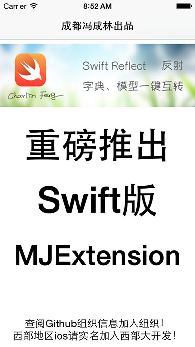

###重磅推出：Swift版的MJExtension，运行时、反射与一键字典模型互转 
##成都冯成林出品 Swfit狂热分子
#### 感谢MJExtension，感谢国外Mirror，感谢stackoverflow的matt大神！

  
 

CFRuntime  1.0 （永久持续更新中！）
==========
  
####只要你会用MJExtension，你会马上上手CFRuntime！
 

    运行时、反射与一键字典模型互转

  

  

组织信息  （请支持西部大开发）
===============
 
#### 特别群：请西部省市朋友实名加入组织。其他地区朋友请添加2-4群：谢谢。
 
【西部大开发】西部大开发群号： 473185026  -追赶北上广！为振兴西部IT而努力！ 
热烈欢迎中国西部各省市的从事iOS开发朋友实名进群！本群为是聚集西部零散开发者，大家齐心协力共进退！   

【全国可加】四群： 347446259 
新开，可加！欢迎全国朋友加入组织   

【全国可加】三群： 474377358 
新开，可加！欢迎全国朋友加入组织   

【全国可加】二群： 369870753 
可加  

【全国可加】一群：163865401 
已爆满，加不上了  

   

框架说明：EXPLAIN
===============
  
1.这个框架是做什么的？ 
>.这个框架可以理解为MJExtension的Swift版本，主要是实现类反射，
并在实现反射功能的基础上实现字典-模型一键互转！

MJExtension(OC): https://github.com/CoderMJLee/MJExtension

  
2.这个框架是对MJExtension的纯Swift翻译吗？ 
>.不是的，虽然两者功能一致，但底层完全不一样。在反射这块上基本代码无任何相同点，只是最终功能效果一致。
在字典-模型一键互转这点上，思路是一致的，都是站在反射功能上实现。

  
3.Swift中有Runtime吗？ 
>.OC中的Runtime在Swift中经过我多次测试，发现是可以用的（但结果比较稀奇古怪），不过Swift底层发动比较大，
而且本身Swift已经不主张Runtime运行时机制，在Swift中是叫Reflect反射，基本可以认为Runtime已经不好用了。

  
4.框架为什么要命名为CFRuntime？ 
>.CF是Charlin Feng的缩写，Runtime主要是我非常这个OC这个特性，就算Swift叫Reflect，但我个人仍想延续经典。

  
5.是否支持Swfit中的结构体？ 
>.不支持，基于以下两点原因：
结构体主要用于数据结构，是值类型，大型数据使用引用类型的类更好。
从继承的角度来说，继承自NSObject，就已经说明问题。

  
6.框架是如何写出来的？ 
>.这个问题比较综合了，因为我公司正式项目已经全部Swift化，但个人对MJExtension依赖太深，同时写了大量延伸框架
，对这套框架需求迫切！最近也在研究Reflect，在参考了国外大量资料和别人的作品，综合MJExtension的理念，
从昨天晚上（2015.07.10 19点）开始连续工作20多个小时写出了这套框架，力求API与MJExtension保持高度一致，
只要你会用MJExtension，你会马上上手CFRuntime！

   

重要说明：EXPLAIN
===============
本框架功能涉及极其复杂，目前还有很多细节没有实现， 
由于本次框架时间太紧，有Bug是正常的，请加群一起讨论完善！ 
不过后续会不停的完善，就像MJExtension、Swift一样， 
都是慢慢成熟完善起来的。请持续关注，我会慢慢完善框架的！ 
   

基本理论 Let's Go!!! （必看）
===============
 
有一些基本理论是你要先注意的，毕竟Swift和OC不一样，在写框架的过程中，强类型语法特性折腾的我够High。。  

1.因为一键字典-模型互转用到了KVC，所以您的模型，必需继承自NSObject。 
2.因为Swift在构造对象之后要求所有属性必需有值，所以你的成员属性有两种选择：一是全部赋初值，二定义为可选。 
不过可惜继承自NSObject，使用OC的KVC之后，会有大量崩溃，因为KVC无法理解一些基本数值型类型可选。 
关于这点我在StackOverflow上提了问题，并得到了国外大牛的回答，请看： 

原文地址： 
http://stackoverflow.com/questions/31353098/swift-optional-property-using-kvc-causes-crash  

    You have already solved the problem perfectly. You cannot use KVC on an Optional Int property, because KVC is Cocoa / Objective-C, and Objective-C cannot see an Optional Int - it is not bridged to Objective-C. Objective-C can only see types that are bridged to Objective-C:
    class types that are derived from NSObject
    class types that are exposed with @objc
    Swift structs that are directly bridged, like Array -> NSArray and String -> NSString.
    Int is not directly bridged; it is bridged to NSNumber, but not directly (it has to be wrapped). If you really need this to be an Optional, and if you really need to use KVC on it, then declare it as NSNumber?, not Int?.

大概意思是，Swift中的框架类型，如果要用到KVC，不要使用Int?、Float? 、Double? 这样的类型。如果一定要用， 
请使用NSNumer?当前这样，你的数据类型就模糊化了。不能看到真正的类型。 
  
所以结果是暂先这样，后期我会更新： 

1.如果是String 或者NSString ：请定义为可选，且只有字符串可选。（因为json中String类型最多，不赋初始值省事） 
2.Int、CGFloat、Float、Double、Bool、自定义对象 一定不能定义为可选，并全部初始化 

   

正式开源 Let's Go!!!
===============

先定义一个模型，请记得继承自NSObject

    class Person: NSObject {
        //String 定义为可选
        var name: NSString?
        
        //Int、CGFloat、Float、Double、Bool 一定不能定义为可选，请手动添加初始值
        var age: Int = 0
        var age2: NSInteger = 0
        
        var weight: Float = 0
        
        var weight2: CGFloat = 0
        
        var money: Double = 0
        
        var isLikeStudy: Bool = false
    }
    
  
### 一、反射： 异常简单
#### 1.获取所有的成员变量：

         var properties = Person.properties
    
就这样就可以了，类方法调用，您无需传任何实例对象，返回值是一个数组,
我们写全就是下面这样：

        var properties: [CFProperty] = Person.properties

其中，CFProperty是属性对象，他含有以下属性：

        /**  属性名  */
        var propertyName: String
        
        /**  属性值  */
        var propertyValue: Any
        
        /**  属性类型  */
        var propertyType: CFPropertyType

先不管这些，你只管，我们现在就来遍历一下，看看反射是否成功？
别用forin了，已经封装了一个遍历器，你会喜欢的，请看：

        properties?.enumerateArrayUsingClosure({ (index, value) -> Void in
            
            println("\(value.propertyName)")
        })

运行一下，查看控制台输出：

    name
    age
    age2
    weight
    weight2
    money
    isLikeStudy
，完全正确！我知道你想要更多的信息，那就来看看CFPropertyType吧，他是指的是属性的类型，头文件如下：

        /**  类型名  */
        var typeName: String{ didSet{ self.calTypeEnum() } }
        
        var typeEnum: CFPropertyTypeEnum
        
        /**  是否是可选类型  */
        var isOptional: Bool
        
        /**  type  */
        var type: Any.Type
        
        /**  selfType  */
        var selfType: Any

貌似很复杂，确实有点，其他先不管，我们只关心typeName即可。
当然你经常这样遍历还是比较麻烦，请看下面的封装：

        /**  类方法直接遍历  */
        Person.enumerateProperties { (index, property) -> Void in
            println("\(property.propertyName)---\(property.propertyType.typeName)")
        }

很方便是吧，来看看控制台输出：

        name---NSString
        age---Int
        age2---Int
        weight---Float
        weight2---Float
        money---Double
        isLikeStudy---Bool
        
是不是很简单？这个就是反射。下面是反射的应用，一键模型转字典：
  
### 二、字典转模型
#### 1.基本模型转化
为了能方便在控制台看到结果，模型需要添加Printable协议并实现方法Descrption方法：

    override var description: String {
        return "name=\(name),age=\(age),age2=\(age2),weight=\(weight),weight2=\(weight2),money=\(money),isLikeStudy=\(isLikeStudy)"
    }

定义一个字典：

        var dict = [
            
            "name":"张三",
            "age": "28",
            "age2":"28",
            "weight":"120",
            "weight2":"120",
            "money":"1800000",
            "isLikeStudy":"1",
            "stuType":"1",
        ]

嘿，boy，还记得MJExtension你是怎么写的吗？go：

        var person = Person.objectWithKeyValues(dict)
        
就是这样的，是不是有一种还是熟悉的味道，还是原来的配方的赶脚！！打印看看结果：

        age=28,name=Optional(张三),age2=28,weight=120.0,weight2=120.0,money=1800000.0,isLikeStudy=true

，那么有朋友要问了，这个是否支持级联操作？试试吧，我们先增加一个Cat类，
为了能够在控制台输出查看，我们要添加Printable协议并实现方法Descrption方法：

    class Cat: NSObject,Printable {
        
        var name: String?
        
        var price: Double = 0
        
        override var description: String {
            return "name=\(name),price=\(price))"
        }
    }
    
然后，在Person里面增加一个属性，记得要有初始值,不要做成可选，现在Person应该是这个样子：

        class Person: NSObject,Printable {
        
            //String 定义为可选
            var name: NSString?
            
            //Int、CGFloat、Float、Double、Bool 一定不能定义为可选
            var age: Int = 0
            var age2: NSInteger = 0
            
            var weight: Float = 0
            
            var weight2: CGFloat = 0
            
            var money: Double = 0
            
            var isLikeStudy: Bool = false
            
            var cat: Cat = Cat()
            
            override var description: String {
                return "name=\(name),age=\(age),age2=\(age2),weight=\(weight),weight2=\(weight2),money=\(money),isLikeStudy=\(isLikeStudy), \n\n cat=\(cat)"
            }
            
        }

当然，我们现在还要修改字典：

        var dict = [
            
            "name":"张三",
            "age": "28",
            "age2":"28",
            "weight":"120",
            "weight2":"120",
            "money":"1800000",
            "isLikeStudy":"1",
            "stuType":"1",
            "cat": [
                "name": "多多",
                "price": "4000"
            ]
        ]

准备好了，来试试API，其实还是刚刚那句，什么都没变，看看能不能自动级联：

        var person = Person.objectWithKeyValues(dict)
        
我们看看控制台输出：

    name=Optional(张三),age=28,age2=28,weight=120.0,weight2=120.0,money=1800000.0,isLikeStudy=true, 
     cat=name=Optional("多多"),price=4000.0)

我们看到，已经成功级联。
  
### 三、模型转字典

同样的，你得先想一下MJExtension是怎么做的：
下面我们来模型一键转字典：

        var dict2 = person.keyValues()

就一句代码，即可，我们打印一下，查看控制台输出：

    [age2: 28, age: 28, money: 1800000.0, name: Optional(张三), weight: 120.0, isLikeStudy: 1, cat: [price: 4000.0, name: Optional("多多")], weight2: 120.0]

 
你可能会想，模型转字典，能自动级联吗，这个问题其实上面已经告诉你答案了（已经实现级联）。
很简单，很熟悉是吧！！！
   

作者寄语 HOPE
===============
周末没有休息，连续奋战20小时无私为大家开源，希望您能支持我。如果您喜欢我的框架，想支持关注， 
请回到顶部投入组织的怀抱。如果您是西部地区，欢迎实名加入西部大开发！
   

结束语 END
===============
MJExtension基本功能已经完成，其实您会发现还有很多细节功能没有完成： 
1.数组级联 
2.属性初始化要求较多，比较麻烦。 
3.模型转字典时，字符串有Option字样等。 
敬请期待2.0版本！！！ 相信我，一切会越来越完善的！！！ 

